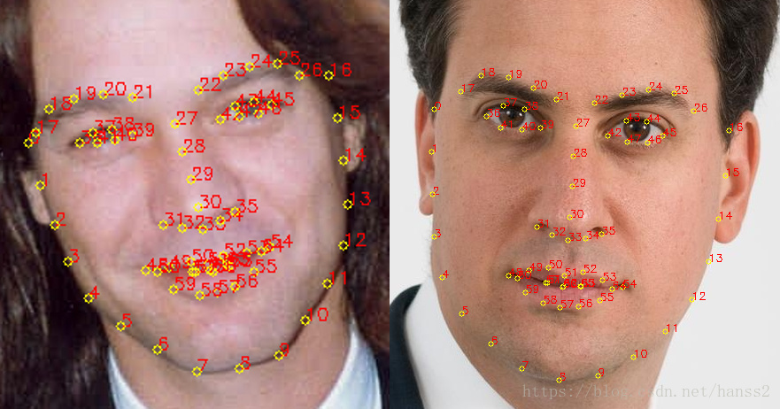
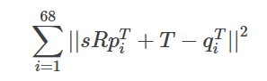

## 轻量级换脸算法的实现

总的来说，其核心思维其实不是用神经网络的方法，

使用Dlib进行人脸检测和68个关键点定位：
这里使用的是ERT方法，源自论文<< One Millisecond Face Alignment with an Ensemble of RegressionTrees>>，算是一种比较老的方法了。但是效果很好。

进行旋转，缩放，平移等变换，即aligement操作，使得第二个图和原始图相互吻合：
这里使用的是普式变换（Ordinary Procrustes Analysis），最终结果是要使得变换过程满足下面式子最小化，简单的说，就是第一个图的68个点经过仿射变换（warp_affine）后，和第二个图的68个点的距离最小，优化目标是：

解释一下这个优化目标：R是一个正交的2∗2矩阵，S是标量，t是2矢量，pi和qi是上面计算的人脸定位矩阵的68个点坐标。

使用奇异值SVD分解（ Singular Value Decomposition），从而求出R:
* U, S, Vt = numpy.linalg.svd(points1.T * points2)
* R = (U * Vt).T

流程如下：
* 将输入矩阵转换为浮点数。这对于后续操作是必需的。
* 减去每个点集的质心。一旦找到点集的最佳的缩放和旋转方式，质心C1和C2可以用来求解最终结果。
* 同样，将每个点按其标准偏差进行划分。这消除了问题的缩放变换的麻烦。
* 利用奇异值分解计算旋转部分。请参阅维基百科关于正交普鲁克斯特问题的文章。
* 返回完整的变换作为仿射变换矩阵。