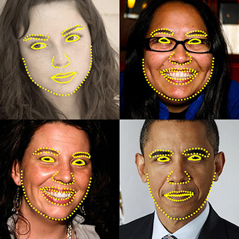

## Face landmark detection in an image

This application lets you detect landmarks of detected faces in an image. You can detect landmarks of all the faces found in an image and use them further in various applications like face swapping, face averaging etc. This functionality is now available in OpenCV.

## Face swapping using face landmark detection

This application lets you swap a face in one image with another face in other image. The application first detects faces in both images and finds its landmarks. Then it swaps the face in first image with in another image. You just have to give paths to the images run the application to swap the two faces.

## Results
Consider two images to be used for face swapping as follows :

### First image

### Second image

### Results after swapping
